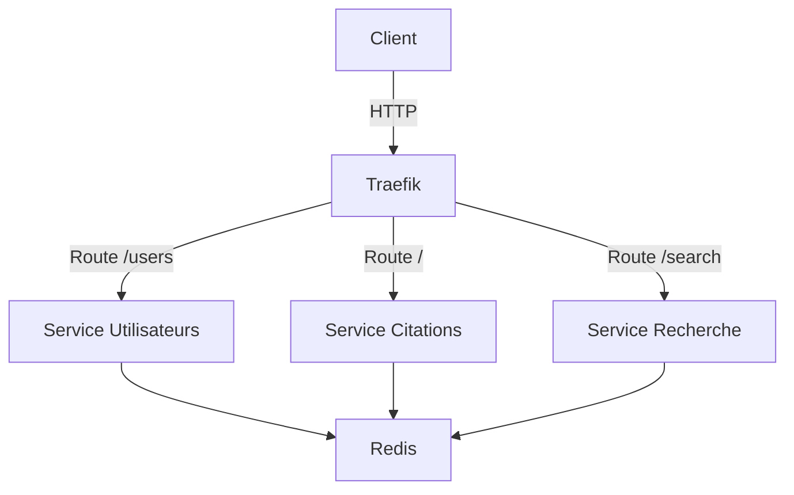

# SAE 503 - Système de Gestion de Citations

Projet de développement d'une application microservices pour la gestion de citations

## 📋 Description du Projet

Ce projet implémente un système de gestion de citations basé sur une architecture microservices avec trois services principaux :

- **Service Utilisateurs** : Gestion des comptes utilisateurs
- **Service Citations** : Création et gestion des citations
- **Service Recherche** : Fonctionnalités de recherche avancée

## 🎯 Objectifs Pédagogiques

- Maîtrise des architectures microservices
- Implémentation de systèmes d'authentification
- Utilisation de Redis pour le stockage de données
- Déploiement avec Docker et Kubernetes
- Intégration continue et tests automatisés

## 🚀 Démarrage Rapide

### Prérequis

- Docker et Docker Compose
- Python 3.12+
- Redis
- Kubernetes (optionnel pour le déploiement avancé)

### Installation

```bash
# Cloner le dépôt
git clone https://github.com/olivinfo/sae503-kc-md.git
cd sae503-kc-md

# Démarrer les services avec Docker Compose
make build
```

### Accès aux Services

- **Service Utilisateurs** : `http://localhost:5000/users`
- **Service Citations** : `http://localhost:5000/`
- **Service Recherche** : `http://localhost:5000/search`
- **Dashboard Traefik** : `http://localhost:8080`

## 📦 Architecture



## 🔐 Système d'Authentification

Le système utilise une authentification basée sur des clés API :

- **Clé par défaut** : `default_key`
- **Transmission** : Via l'en-tête HTTP `Authorization`
- **Validation** : Chaque service valide indépendamment le token

### Exemple d'utilisation

```bash
# Requête avec authentification
curl -X POST http://localhost:5000/quotes \
  -H "Authorization: default_key" \
  -H "Content-Type: application/json" \
  -d '{"user_id": "1", "quote": "Ma citation"}'
```

## 🧪 Tests

### Tests Unitaires

```bash
# Exécuter tous les tests unitaires
make test-unitaires

# Tests spécifiques par service manuelment
pytest citations_haddock/users/ -v
pytest citations_haddock/quotes/ -v
pytest citations_haddock/search/ -v
```

### Tests Fonctionnels

```bash
make test-fonctionnel
```

ou manuelment

```bash
# Exécuter les tests fonctionnels
python tests/test_functional.py

# Exécuter les tests d'authentification
python tests/test_authentification.py
```

## 📂 Structure du Projet

```txt
sae503-kc-md/
├── citations_haddock/
│   ├── users/              # Service Utilisateurs
│   │   ├── users.py        # Application Flask
│   │   ├── test.py         # Tests unitaires
│   │   └── test_auth.py    # Tests d'authentification
│   │
│   ├── quotes/             # Service Citations
│   │   ├── quotes.py       # Application Flask
│   │   ├── test.py         # Tests unitaires
│   │   └── test_auth.py    # Tests d'authentification
│   │
│   ├── search/             # Service Recherche
│   │   ├── search.py       # Application Flask
│   │   ├── test.py         # Tests unitaires
│   │   └── test_auth.py    # Tests d'authentification
│   │
│   ├── data/               # Données initiales (CSV)
│   └── requirements.txt    # Dépendances Python
│
├── kube/                  # Configuration Kubernetes
│   ├── traefik/            # Configuration Traefik
│   └── *.yaml              # Manifestes Kubernetes
│
├── tests/                 # Tests fonctionnels
│   ├── test_functional.py  # Tests d'intégration
│   └── test_authentification.py # Tests d'authentification
│
├── docker-compose.yaml    # Orchestration Docker
├── README.md              # Documentation
├── PROBLEMS.md            # Problèmes rencontrés et solutions
└── Cahier_charges_SAE503.pdf # Cahier des charges
```

## 🛠 Technologies Utilisées

- **Backend** : Flask (Python)
- **Base de données** : Redis
- **Containerisation** : Docker
- **Orchestration** : Docker Compose, Kubernetes
- **Reverse Proxy** : Traefik
- **Tests** : Pytest, Unittest
- **Documentation** : Swagger (Flasgger)

## 📖 Fonctionnalités

### Service Utilisateurs

- `GET /` : Point d'entrée du service
- `GET /users` : Liste tous les utilisateurs (authentification requise)
- `POST /users` : Crée un nouvel utilisateur (authentification requise)

### Service Citations

- `POST /quotes` : Ajoute une nouvelle citation (authentification requise)
- `DELETE /quotes/<id>` : Supprime une citation (authentification requise)

### Service Recherche

- `GET /search?keyword=<mot>` : Recherche des citations (authentification requise)

## 🔧 Configuration

Les variables d'environnement disponibles :

```env
# Configuration Redis
REDIS_HOST=redis
REDIS_PORT=6379
REDIS_DB=0

# Configuration Application
APP_PORT=5000
ADMIN_KEY=default_key

# Fichiers de données
CSV_FILE_USERS=initial_data_users.csv
CSV_FILE_QUOTES=initial_data_quotes.csv
```

## 🔨 Makefile - Commandes Utiles

Le projet inclut un Makefile pour simplifier les opérations courantes :

```bash
# Installer les dépendances
make install

# Démarrer les services
make start

# Arrêter les services
make stop

# Exécuter les tests
make test

# Nettoyer l'environnement
make clean

# Construire et démarrer en production
make prod
```

Voir le fichier `Makefile` pour la liste complète des commandes disponibles.

## 🚀 Déploiement Kubernetes

```bash
# Appliquer la configuration Kubernetes
kubectl apply -f kube/

# Vérifier les pods
kubectl get pods

# Accéder aux services via Traefik
kubectl port-forward service/traefik 8080:8080
```

## 📈 Améliorations Futures

- Implémentation de JWT pour l'authentification
- Service d'authentification centralisé
- Monitoring et logging avec Prometheus/Grafana
- CI/CD avec GitHub Actions
- Documentation API complète avec Swagger
- Tests de charge et optimisation des performances

## 🤝 Contributeurs

- [Votre Nom](https://github.com/votre-utilisateur)
- [Autre Contributeur](https://github.com/autre-utilisateur)

## 📄 Licence

Ce projet est sous licence MIT. Voir le fichier `LICENSE` pour plus de détails.

## 📞 Support

Pour toute question ou problème, veuillez ouvrir une issue sur GitHub ou contacter l'équipe de développement.

---

Projet réalisé dans le cadre de la SAE 503 - Conception et Développement d'Applications
