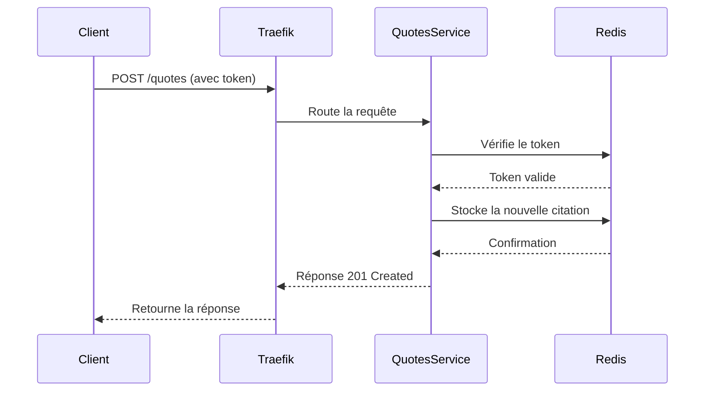

# 2. Architecture Globale

## 2.1 Vue d'ensemble

L'architecture du projet "Citations Haddock" est basée sur une approche moderne de microservices, orchestrée par Kubernetes et sécurisée selon les meilleures pratiques du domaine.

### Architecture en couches

```txt
┌───────────────────────────────────────────────────────────────┐
│                       Utilisateurs Finaux                     │
└───────────────────────────────────────────────────────────────┘
                                │
                                ▼
┌───────────────────────────────────────────────────────────────┐
│                       Reverse Proxy (Traefik)                 │
└───────────────────────────────────────────────────────────────┘
                                │
                                ▼
┌───────────────────────────────────────────────────────────────┐
│                        Microservices Applications             │
│  ┌─────────────┐    ┌─────────────┐    ┌───────────────────┐  │
│  │  Users      │    │  Quotes     │    │  Search           │  │
│  │  Service    │    │  Service    │    │  Service          │  │
│  └─────────────┘    └─────────────┘    └───────────────────┘  │
└───────────────────────────────────────────────────────────────┘
                                │
                                ▼
┌───────────────────────────────────────────────────────────────┐
│                       Base de données (Redis)                 │
└───────────────────────────────────────────────────────────────┘
                                │
                                ▼
┌───────────────────────────────────────────────────────────────┐
│                        Infrastructure Kubernetes              │
│  ┌─────────────┐    ┌─────────────┐    ┌───────────────────┐  │
│  │  Namespace  │    │  Pods       │    │  Services         │  │
│  │  (haddock)  │    │  &          │    │  & Ingress        │  │
│  └─────────────┘    │  Containers │    └───────────────────┘  │
│                     └─────────────┘                           │
└───────────────────────────────────────────────────────────────┘
```

## 2.2 Composants principaux

### 2.2.1 Microservices

L'application est divisée en trois microservices principaux :

1. **Users Service** : Gestion des utilisateurs
   - Endpoints : `/users`
   - Fonctionnalités : Création, lecture, mise à jour et suppression des utilisateurs
   - Technologie : Flask (Python)

2. **Quotes Service** : Gestion des citations
   - Endpoints : `/quotes`
   - Fonctionnalités : Ajout, suppression et récupération des citations
   - Technologie : Flask (Python)

3. **Search Service** : Recherche de citations
   - Endpoints : `/search`
   - Fonctionnalités : Recherche de citations par mots-clés
   - Technologie : Flask (Python)

### 2.2.2 Infrastructure

1. **Kubernetes** : Orchestrateur de conteneurs
   - Gestion des pods, services et ingress
   - Isolation via namespaces
   - Scalabilité horizontale

2. **Traefik** : Reverse proxy et load balancer
   - Routage des requêtes HTTP
   - Terminaison SSL
   - Rate limiting (configurable)

3. **Redis** : Base de données
   - Stockage des données utilisateurs et citations
   - Cache pour les recherches
   - Persistance des données

4. **Docker** : Conteneurisation
   - Images Docker pour chaque microservice
   - Environnements isolés et reproductibles

## 2.3 Flux de données

### 2.3.1 Flux principal

```txt
1. L'utilisateur envoie une requête HTTP à l'application
2. Traefik reçoit la requête et la route vers le microservice approprié
3. Le microservice traite la requête et interagit avec Redis si nécessaire
4. Le microservice renvoie une réponse au client via Traefik
```

### 2.3.2 Exemple détaillé : Ajout d'une citation

```txt
┌─────────────┐       ┌─────────────────┐       ┌─────────────┐
│             │       │                 │       │             │
│  Client     │─────▶│  Traefik         │─────▶│  Quotes     │
│             │       │                 │       │  Service    │
└─────────────┘       └─────────────────┘       └─────────────┘
        ▲                     ▲                             │
        │                     │                             ▼
        │                     │                   ┌─────────────┐
        │                     │                   │             │
        │                     │                   │  Redis      │
        │                     │                   │             │
        │                     │                   └─────────────┘
        │                     │                             ▲
        │                     │                             │
┌─────────────┐       ┌─────────────────┐       ┌─────────────┐
│             │       │                 │       │             │
│  Client     │◀──────│  Traefik       │◀──────│  Quotes     │
│             │       │                 │       │  Service    │
└─────────────┘       └─────────────────┘       └─────────────┘
```

## 2.4 Diagrammes d'architecture

### 2.4.1 Diagramme de déploiement Kubernetes


### 2.4.2 Diagramme de composants


### 2.4.3 Diagramme de séquence



## 2.5 Matrice de flux réseau

| Source          | Destination      | Protocole | Port   | Description                     |
|-----------------|------------------|-----------|--------|---------------------------------|
| Client          | Traefik          | HTTP      | 80     | Accès à l'application           |
| Client          | Traefik          | HTTP      | 5000   | Accès alternatif                |
| Traefik         | Users Service    | HTTP      | 5000   | Routage vers le service users   |
| Traefik         | Quotes Service   | HTTP      | 5000   | Routage vers le service quotes  |
| Traefik         | Search Service   | HTTP      | 5000   | Routage vers le service search  |
| Users Service   | Redis            | TCP       | 6379   | Accès à la base de données      |
| Quotes Service  | Redis            | TCP       | 6379   | Accès à la base de données      |
| Search Service  | Redis            | TCP       | 6379   | Accès à la base de données      |

## 2.6 Topologie réseau

```txt
┌─────────────────────────────────────────────────────────────────────┐
│                        Réseau Kubernetes (proxy)                    │
│                                                                     │
│  ┌─────────────┐    ┌─────────────┐    ┌─────────────┐    ┌───────┐ │
│  │             │    │             │    │             │    │       │ │
│  │  Traefik    │◀───▶│  Users    │    │  Quotes     │    │ Redis │ │
│  │  (Ingress)  │    │  Service    │    │  Service    │    │       │ │
│  │             │    │             │    │             │    │       │ │
│  └─────────────┘    └─────────────┘    └─────────────┘    └───────┘ │
│          ▲                                                          │
│          │                                                          │
│  ┌───────────────────────────────────────────────────────────────┐  │
│  │                   Réseau Externe (Internet)                   │  │
│  │                                                               │  │
│  │  ┌─────────────┐    ┌─────────────┐    ┌───────────────────┐  │  │
│  │  │             │    │             │    │                   │  │  │
│  │  │  Client 1   │    │  Client 2   │    │  Client N         │  │  │
│  │  │             │    │             │    │                   │  │  │
│  │  └─────────────┘    └─────────────┘    └───────────────────┘  │  │
│  └───────────────────────────────────────────────────────────────┘  │
│                                                                     │
└─────────────────────────────────────────────────────────────────────┘
```
