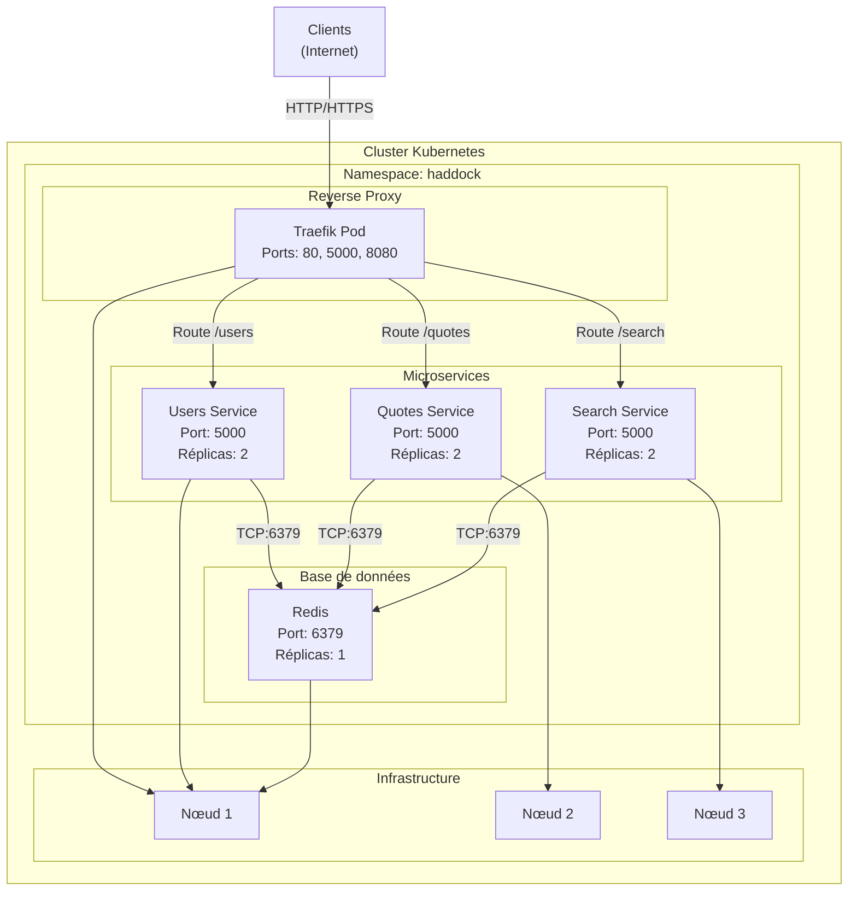
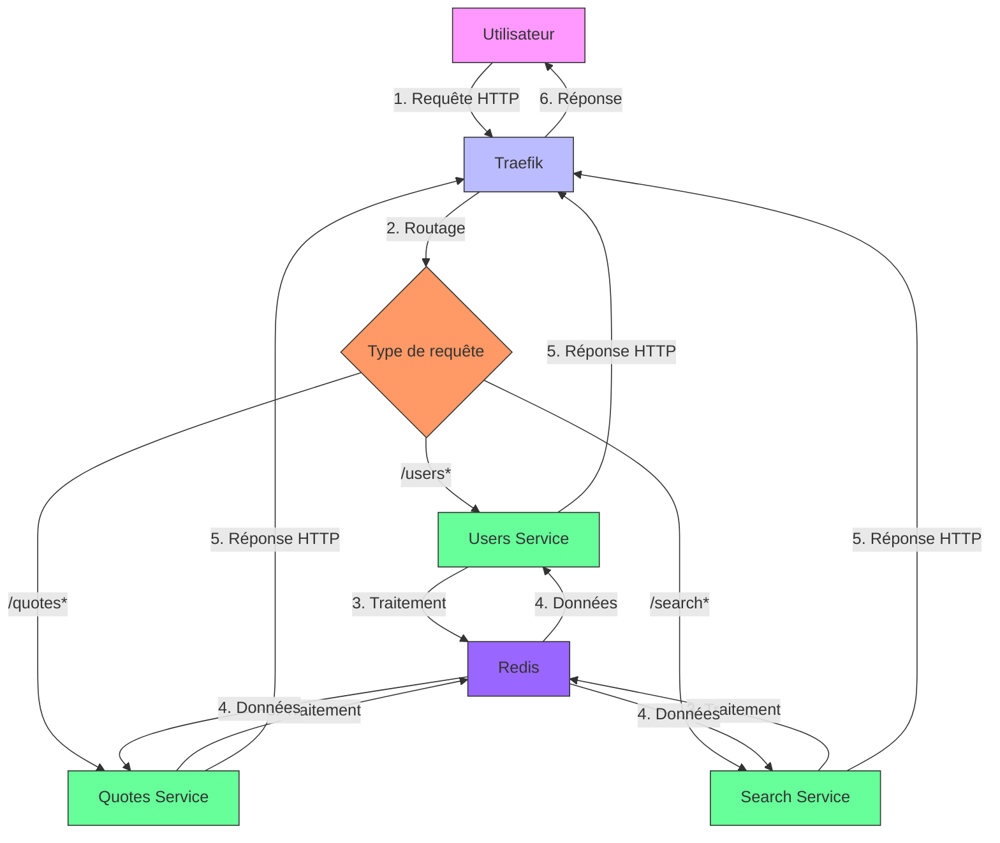
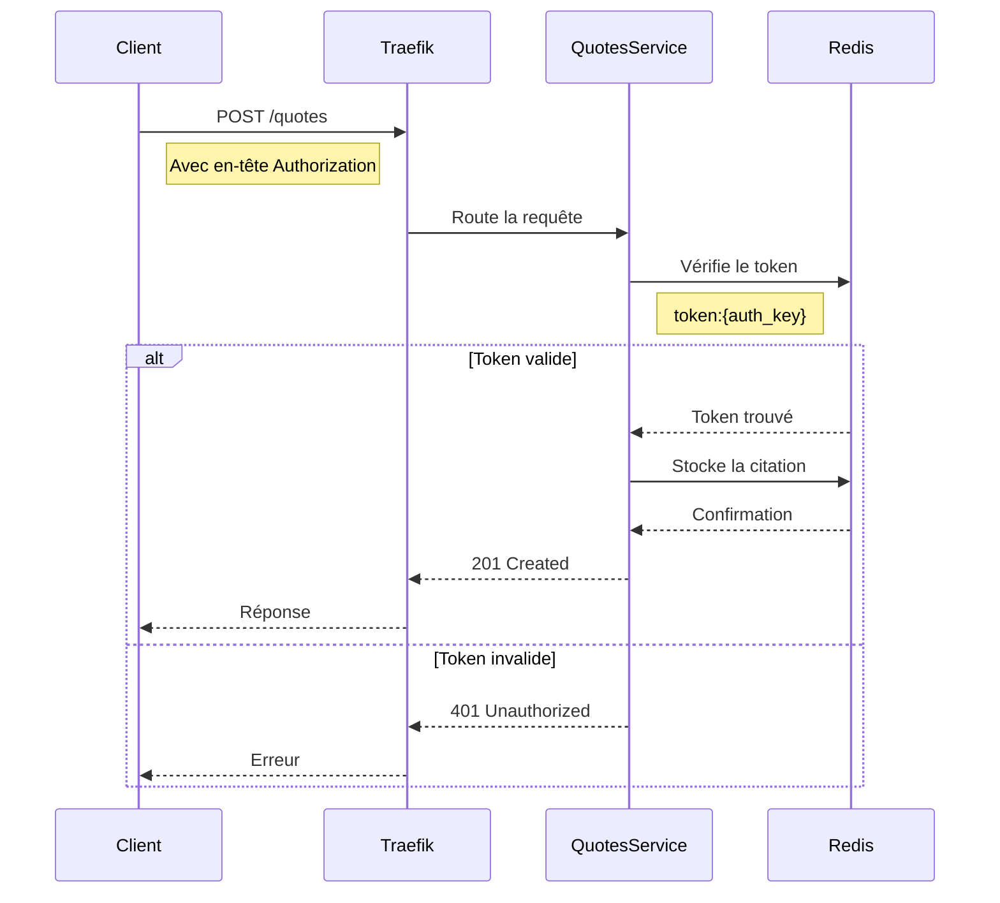

# 7. Annexes

## 7.1 Glossaire

### 7.1.1 Termes techniques

| Terme                  | Définition                                                                                                                                                                                                 | Contexte d'utilisation                                                                 |
|------------------------|------------------------------------------------------------------------------------------------------------------------------------------------------------------------------------------------------------|---------------------------------------------------------------------------------------|
| **API**                | Application Programming Interface - Interface permettant à différents logiciels de communiquer entre eux.                                                                                                  | Utilisé pour décrire les endpoints des microservices.                                  |
| **CI/CD**              | Continuous Integration / Continuous Deployment - Pratiques de développement logiciel visant à automatiser les tests et le déploiement.                                                   | Mentionné dans les bonnes pratiques de déploiement.                                    |
| **Container**          | Environnement isolé et léger qui contient une application et ses dépendances.                                                                                                                             | Base de l'architecture avec Docker et Kubernetes.                                      |
| **CRUD**               | Create, Read, Update, Delete - Opérations de base pour la gestion des données.                                                                                                                             | Décrit les fonctionnalités des microservices.                                          |
| **Dashboard**          | Interface utilisateur graphique pour visualiser des données et métriques.                                                                                                                                 | Traefik dashboard pour le monitoring.                                                   |
| **Deployment**         | Ressource Kubernetes qui gère les répliques de pods et leurs mises à jour.                                                                                                                                | Utilisé pour déployer les microservices.                                               |
| **Endpoint**           | Point d'accès à une API ou un service.                                                                                                                                                                    | Les URLs comme `/quotes`, `/users`, etc.                                               |
| **FQDN**               | Fully Qualified Domain Name - Nom de domaine complet.                                                                                                                                                     | Utilisé pour l'accès aux services via Traefik.                                         |
| **Health Check**       | Vérification automatique de l'état de santé d'un service.                                                                                                                                                 | Endpoints comme `/health` pour vérifier le bon fonctionnement.                          |
| **Helm**               | Gestionnaire de paquets pour Kubernetes qui permet de définir, installer et mettre à jour des applications Kubernetes.                                                                                   | Option de déploiement alternative.                                                     |
| **HPA**                | Horizontal Pod Autoscaler - Composant Kubernetes qui ajuste automatiquement le nombre de pods en fonction de la charge.                                                                                   | Pour la mise à l'échelle automatique.                                                  |
| **Ingress**            | Ressource Kubernetes qui gère l'accès externe aux services dans un cluster.                                                                                                                              | Configuration de Traefik pour le routage.                                              |
| **JWT**                | JSON Web Token - Standard ouvert pour la création de tokens d'authentification.                                                                                                                          | Amélioration future de l'authentification.                                             |
| **KPI**                | Key Performance Indicator - Indicateur clé de performance.                                                                                                                                               | Métriques pour évaluer la performance du système.                                      |
| **Load Balancer**      | Composant qui distribue le trafic réseau entre plusieurs serveurs.                                                                                                                                      | Fonctionnalité de Traefik.                                                             |
| **Microservice**       | Architecture logicielle où une application est développée comme une suite de petits services indépendants.                                                                                              | Architecture globale du projet.                                                        |
| **Namespace**          | Méthode de partitionnement des ressources dans un cluster Kubernetes.                                                                                                                                    | Isolation des environnements (ex: `haddock`).                                          |
| **OOM Killer**         | Out Of Memory Killer - Mécanisme du noyau Linux qui termine les processus consommant trop de mémoire.                                                                                                    | Cause potentielle de problèmes de stabilité.                                           |
| **Pod**                | Plus petite unité déployable dans Kubernetes, contenant un ou plusieurs conteneurs.                                                                                                                      | Unité de base de déploiement.                                                          |
| **RDB**                | Redis Database - Format de sauvegarde de Redis.                                                                                                                                                          | Sauvegarde des données Redis.                                                          |
| **RBAC**               | Role-Based Access Control - Système de contrôle d'accès basé sur les rôles.                                                                                                                              | Amélioration future de la sécurité.                                                    |
| **Reverse Proxy**      | Serveur qui se place entre les clients et les serveurs pour distribuer les requêtes.                                                                                                                     | Rôle de Traefik dans l'architecture.                                                   |
| **Rolling Update**     | Stratégie de déploiement qui met à jour les pods progressivement pour éviter les interruptions.                                                                                                          | Mise à jour des services sans temps d'arrêt.                                           |
| **Service**            | Ressource Kubernetes qui expose une application en tant que service réseau.                                                                                                                              | Exposition des microservices.                                                          |
| **Stateless**          | Application qui ne stocke pas d'état entre les requêtes.                                                                                                                                                 | Caractéristique des microservices.                                                     |
| **Swagger**            | Outil pour concevoir, construire, documenter et consommer des APIs RESTful.                                                                                                                              | Documentation des APIs avec Flasgger.                                                  |
| **Token**              | Jetons d'authentification utilisés pour accéder aux services protégés.                                                                                                                                    | Système d'authentification actuel.                                                     |
| **YAML**               | Format de sérialisation de données lisible par l'homme, utilisé pour les fichiers de configuration.                                                                                                      | Format des fichiers Kubernetes et Docker Compose.                                      |

### 7.1.2 Acronymes

| Acronyme | Signification                                                                 | Contexte                                                                 |
|----------|-------------------------------------------------------------------------------|--------------------------------------------------------------------------|
| API      | Application Programming Interface                                             | Communication entre services                                            |
| CI/CD    | Continuous Integration / Continuous Deployment                               | Automatisation des tests et déploiements                               |
| CRUD     | Create, Read, Update, Delete                                                 | Opérations de base sur les données                                     |
| CSV      | Comma-Separated Values                                                       | Format des fichiers de données initiaux                               |
| DAT      | Dossier d'Architecture Technique                                             | Ce document                                                             |
| FQDN     | Fully Qualified Domain Name                                                 | Noms de domaine complets                                               |
| HPA      | Horizontal Pod Autoscaler                                                   | Mise à l'échelle automatique dans Kubernetes                           |
| HTTP     | Hypertext Transfer Protocol                                                 | Protocole de communication web                                         |
| HTTPS    | Hypertext Transfer Protocol Secure                                          | Version sécurisée de HTTP                                               |
| JSON     | JavaScript Object Notation                                                  | Format d'échange de données                                            |
| K8s      | Kubernetes                                                                 | Orchestrateur de conteneurs                                            |
| OOM      | Out Of Memory                                                              | Erreur liée à l'épuisement de la mémoire                              |
| RBAC     | Role-Based Access Control                                                  | Contrôle d'accès basé sur les rôles                                    |
| RDB      | Redis Database                                                            | Format de sauvegarde Redis                                              |
| REST     | Representational State Transfer                                            | Style d'architecture pour les APIs                                     |
| SAE      | Situation d'Apprentissage et d'Évaluation                                  | Contexte pédagogique du projet                                         |
| SSL      | Secure Sockets Layer                                                      | Protocole de sécurité pour les communications                          |
| TLS      | Transport Layer Security                                                  | Successor de SSL                                                       |
| VM       | Virtual Machine                                                           | Machine virtuelle                                                      |

## 7.2 Références

### 7.2.1 Documentation officielle

#### 7.2.1.1 Kubernetes

- [Documentation Kubernetes](https://kubernetes.io/docs/home/)
- [Kubernetes Concepts](https://kubernetes.io/docs/concepts/)
- [Kubernetes Tutorials](https://kubernetes.io/docs/tutorials/)
- [Kubectl Cheat Sheet](https://kubernetes.io/docs/reference/kubectl/cheatsheet/)

#### 7.2.1.2 Docker

- [Documentation Docker](https://docs.docker.com/)
- [Docker Get Started](https://docs.docker.com/get-started/)
- [Docker Compose](https://docs.docker.com/compose/)
- [Dockerfile Reference](https://docs.docker.com/engine/reference/builder/)

#### 7.2.1.3 Traefik

- [Documentation Traefik](https://doc.traefik.io/traefik/)
- [Traefik Kubernetes Provider](https://doc.traefik.io/traefik/providers/kubernetes-crd/)
- [Traefik Middlewares](https://doc.traefik.io/traefik/middlewares/overview/)

#### 7.2.1.4 Redis

- [Documentation Redis](https://redis.io/documentation)
- [Redis Commands](https://redis.io/commands)
- [Redis Python Client](https://redis-py.readthedocs.io/)

#### 7.2.1.5 Flask

- [Documentation Flask](https://flask.palletsprojects.com/)
- [Flask API](https://flask.palletsprojects.com/en/2.3.x/api/)
- [Flasgger](https://github.com/flasgger/flasgger)

### 7.2.2 Outils et bibliothèques

#### 7.2.2.1 Monitoring et Logging

- [Prometheus](https://prometheus.io/docs/introduction/overview/)
- [Grafana](https://grafana.com/docs/)
- [ELK Stack](https://www.elastic.co/what-is/elk-stack)
- [Loki](https://grafana.com/oss/loki/)

#### 7.2.2.2 Sécurité

- [Trivy](https://aquasecurity.github.io/trivy/)
- [OWASP Top 10](https://owasp.org/www-project-top-ten/)
- [Kubernetes Security](https://kubernetes.io/docs/concepts/security/)

#### 7.2.2.3 Développement

- [Python Documentation](https://docs.python.org/3/)
- [Pytest](https://docs.pytest.org/)
- [Black Formatter](https://black.readthedocs.io/)

### 7.2.3 Bonnes pratiques

#### 7.2.3.1 Architecture

- [12 Factor App](https://12factor.net/)
- [Microservices.io](https://microservices.io/)
- [Kubernetes Patterns](https://github.com/containerized/patterns)

#### 7.2.3.2 Sécurité

- [CIS Kubernetes Benchmark](https://www.cisecurity.org/benchmark/kubernetes/)
- [Kubernetes Security Best Practices](https://kubernetes.io/docs/concepts/security/best-practices/)
- [Docker Security](https://docs.docker.com/engine/security/)

#### 7.2.3.3 Déploiement

- [GitOps](https://www.gitops.tech/)
- [Continuous Delivery](https://continuousdelivery.com/)
- [Infrastructure as Code](https://www.hashicorp.com/resources/what-is-infrastructure-as-code)

## 7.3 Diagrammes techniques

### 7.3.1 Diagrammes Mermaid

#### 7.3.1.1 Diagramme de déploiement complet



#### 7.3.1.2 Diagramme de flux de données



#### 7.3.1.3 Diagramme de séquence d'authentification



### 7.3.2 Diagrammes d'architecture

#### 7.3.2.1 Architecture en couches

```
┌─────────────────────────────────────────────────────────────────────────────┐
│                                COUCHE PRÉSENTATION                           │
│  ┌───────────────────────────────────────────────────────────────────────┐  │
│  │                        Interface Utilisateur                         │  │
│  │  - Navigateurs web                                                  │  │
│  │  - Applications clientes                                            │  │
│  └───────────────────────────────────────────────────────────────────────┘  │
└─────────────────────────────────────────────────────────────────────────────┘
                                │
                                ▼
┌─────────────────────────────────────────────────────────────────────────────┐
│                                COUCHE APPLICATION                           │
│  ┌───────────────────────────────────────────────────────────────────────┐  │
│  │                        Reverse Proxy (Traefik)                       │  │
│  │  - Routage des requêtes                                            │  │
│  │  - Load balancing                                                  │  │
│  │  - Terminaison SSL                                                │  │
│  └───────────────────────────────────────────────────────────────────────┘  │
│                                                                         │  │
│  ┌─────────────┐  ┌─────────────┐  ┌───────────────────┐                  │  │
│  │  Users       │  │  Quotes     │  │  Search          │                  │  │
│  │  Service     │  │  Service    │  │  Service         │                  │  │
│  │  - Flask     │  │  - Flask    │  │  - Flask         │                  │  │
│  │  - Python    │  │  - Python   │  │  - Python        │                  │  │
│  └─────────────┘  └─────────────┘  └───────────────────┘                  │  │
└─────────────────────────────────────────────────────────────────────────────┘
                                │
                                ▼
┌─────────────────────────────────────────────────────────────────────────────┐
│                                COUCHE DONNÉES                               │
│  ┌───────────────────────────────────────────────────────────────────────┐  │
│  │                        Base de données (Redis)                       │  │
│  │  - Stockage clé-valeur                                            │  │
│  │  - Cache                                                         │  │
│  │  - Persistance                                                   │  │
│  └───────────────────────────────────────────────────────────────────────┘  │
└─────────────────────────────────────────────────────────────────────────────┘
                                │
                                ▼
┌─────────────────────────────────────────────────────────────────────────────┐
│                                COUCHE INFRASTRUCTURE                        │
│  ┌───────────────────────────────────────────────────────────────────────┐  │
│  │                        Kubernetes Cluster                          │  │
│  │  - Nœuds                                                         │  │
│  │  - Pods                                                          │  │
│  │  - Services                                                      │  │
│  │  - Networking                                                    │  │
│  │  - Storage                                                       │  │
│  └───────────────────────────────────────────────────────────────────────┘  │
└─────────────────────────────────────────────────────────────────────────────┘
```

## 7.4 Fichiers de configuration

### 7.4.1 Fichiers Kubernetes

#### 7.4.1.1 deployment.yaml (extrait)

```yaml
apiVersion: v1
kind: Namespace
metadata:
  name: haddock
---
apiVersion: apps/v1
kind: Deployment
metadata:
  name: redis-deployment
  namespace: haddock
  labels:
    app: redis
spec:
  replicas: 1
  selector:
    matchLabels:
      app: redis
  template:
    metadata:
      labels:
        app: redis
    spec:
      containers:
      - name: redis
        image: redis:8
        ports:
        - containerPort: 6379
---
apiVersion: v1
kind: Service
metadata:
  name: backend-redis
  namespace: haddock
spec:
  selector:
    app: redis 
  ports:
  - port: 6379
    targetPort: 6379
```

#### 7.4.1.2 traefik.yaml

```yaml
apiVersion: networking.k8s.io/v1
kind: Ingress
metadata:
  name: reverse-proxy
  namespace: haddock
  annotations:
    traefik.ingress.kubernetes.io/router.entrypoints: web
spec:
  rules:
  - host: localhost.local
    http:
      paths:
      - path: /users
        pathType: Prefix
        backend:
          service:
            name: backend-users
            port:
              number: 80
      - path: /quotes
        pathType: Prefix
        backend:
          service:
            name: backend-quotes
            port:
              number: 80
      - path: /search
        pathType: Prefix
        backend:
          service:
            name: backend-search
            port:
              number: 80
```

### 7.4.2 Fichiers Docker

#### 7.4.2.1 Dockerfile (Quotes Service)

```dockerfile
FROM python:3.12-slim
LABEL org.opencontainers.image.source=https://github.com/olivinfo/sae503-kc-md
WORKDIR /app

RUN apt-get update && apt-get dist-upgrade -y && apt-get install -y curl --no-install-recommends

COPY requirements.txt .
RUN pip install --no-cache-dir -r requirements.txt

RUN adduser user
USER user

COPY quotes/ .
COPY data/ .

ENV REDIS_HOST="backend-redis"

EXPOSE 5000

HEALTHCHECK --interval=5s --timeout=2s --retries=2 --start-period=5s CMD curl --fail http://localhost:5000/quotes/health || exit 1

CMD ["python", "quotes.py"]
```

#### 7.4.2.2 docker-compose.yaml (extrait)

```yaml
services:
  traefik:
    image: "traefik"
    container_name: "traefik"
    restart: unless-stopped
    security_opt:
      - no-new-privileges:true
    networks:
      - proxy
    command:
      - "--providers.docker=true"
      - "--api.insecure=true"
      - "--providers.docker.exposedbydefault=false"
      - "--providers.docker.network=proxy"
      - "--entryPoints.web.address=:80"
      - "--entryPoints.haddock.address=:5000"
    ports:
      - "80:80"
      - "5000:5000"
      - "8080:8080"
    volumes:
      - "/var/run/docker.sock:/var/run/docker.sock:ro"

  quotes:
    build:
      context: citations_haddock
      dockerfile: quotes/Dockerfile
    ports:
      - "5001:5000"
    networks:
      - proxy
    depends_on:
      - redis
      - traefik
    environment:
      - REDIS_HOST=redis
      - REDIS_PORT=6379
      - REDIS_DB=0
      - APP_PORT=5000
    labels:
      - "traefik.enable=true"
      - "traefik.http.routers.quotes.rule=PathPrefix(`/quotes`)"
      - "traefik.http.routers.quotes.entrypoints=haddock"
      - "traefik.http.services.quotes.loadbalancer.server.port=5000"

networks:
  proxy:
    name: proxy
```

### 7.4.3 Fichiers de configuration des services

#### 7.4.3.1 quotes.py (extrait)

```python
"""
Docstring for citations_haddock.quotes.quotes
A Flask application to manage quotes with Redis as the database.
Provides endpoints to add and delete quotes with authentication.
"""

import os
import csv
from functools import wraps
from flask import Flask, request, jsonify
from redis import Redis
from flasgger import Swagger

REDIS_HOST = os.getenv("REDIS_HOST", "localhost")
REDIS_PORT = int(os.getenv("REDIS_PORT", "6379"))
REDIS_DB = int(os.getenv("REDIS_DB", "0"))
APP_PORT = int(os.getenv("APP_PORT", "5000"))
CSV_FILE_QUOTES = os.getenv("CSV_FILE_QUOTES", "initial_data_quotes.csv")

app = Flask(__name__)
swagger = Swagger(app)
redis_client = Redis(host=REDIS_HOST, port=REDIS_PORT, db=REDIS_DB, decode_responses=True)

def require_auth(f):
    @wraps(f)
    def decorated(*args, **kwargs):
        auth_key = request.headers.get("Authorization")
        if not auth_key:
            return jsonify({"error": "Authorization header is missing"}), 401
        token_key = f"token:{auth_key}"
        if not redis_client.exists(token_key):
            return jsonify({"error": "Unauthorized: Invalid token"}), 401
        return f(*args, **kwargs)
    return decorated

@app.route('/quotes/health')
def helloworld():
    return jsonify({"message": "healthy"}), 200

@app.route('/quotes', methods=['GET'])
def get_quotes():
    """
    Récupérer toutes les citations
    ---
    security:
      - APIKeyAuth: []
    responses:
      200:
        description: Liste des citations
    """
    quotes = redis_client.smembers("quotes")
    quote_list=[]
    for quote in quotes:
        quote_list.append(redis_client.hgetall(quote))
    return jsonify(quote_list), 200
```

## 7.5 Exemples de commandes

### 7.5.1 Commandes Kubernetes

```bash
# Création et gestion des ressources
kubectl create namespace haddock
kubectl apply -f kube/deployment.yaml
kubectl get pods -n haddock
kubectl describe pod <nom-du-pod> -n haddock
kubectl logs <nom-du-pod> -n haddock
kubectl delete pod <nom-du-pod> -n haddock

# Gestion des déploiements
kubectl get deployments -n haddock
kubectl scale deployment quotes-service --replicas=3 -n haddock
kubectl rollout status deployment quotes-service -n haddock
kubectl rollout undo deployment quotes-service -n haddock

# Surveillance
kubectl top pods -n haddock
kubectl get events -n haddock
kubectl get hpa -n haddock

# Réseau
kubectl get services -n haddock
kubectl get ingress -n haddock
kubectl exec -it <nom-du-pod> -n haddock -- ping <autre-service>
```

### 7.5.2 Commandes Docker

```bash
# Gestion des conteneurs
docker build -t kitami1/sae503-quotes -f citations_haddock/quotes/Dockerfile citations_haddock
docker run -d -p 5000:5000 kitami1/sae503-quotes
docker ps
docker logs <nom-du-conteneur>
docker stop <nom-du-conteneur>
docker rm <nom-du-conteneur>

# Gestion des images
docker images
docker rmi <nom-de-l-image>
docker pull redis:8
docker system prune -a

# Réseau
docker network create proxy
docker network ls
docker network inspect proxy
```

### 7.5.3 Commandes de test

```bash
# Tests unitaires
pytest citations_haddock/quotes/test.py
pytest citations_haddock/users/test.py
pytest citations_haddock/search/test.py

# Tests fonctionnels
pytest tests/test_functional.py

# Tests de sécurité
trivy fs --scanners vuln .
trivy fs --scanners secret .
trivy image kitami1/sae503-quotes:1.0.0

# Tests de santé
curl http://localhost/quotes/health
curl http://localhost/users/health
curl http://localhost/search/health
```

### 7.5.4 Commandes de déploiement

```bash
# Déploiement complet
make build
make test
kubectl apply -f kube/deployment.yaml

# Nettoyage
make clean
docker system prune -a
kubectl delete namespace haddock

# Monitoring
kubectl get pods -n haddock -w
kubectl logs -f <nom-du-pod> -n haddock
curl http://localhost:8080/dashboard/
```

## 7.6 Modèles et templates

### 7.6.1 Template de rapport d'incident

```markdown
# Rapport d'incident - [ID]

## Résumé
- **Date** : [Date et heure]
- **Service affecté** : [Nom du service]
- **Impact** : [Haut/Moyen/Faible]
- **Durée** : [Durée de l'incident]
- **Statut** : [Résolu/En cours/Non résolu]

## Description
[Description détaillée du problème rencontré]

## Symptômes observés
- [Symptôme 1]
- [Symptôme 2]
- [Symptôme 3]

## Étapes de reproduction
1. [Étape 1]
2. [Étape 2]
3. [Étape 3]

## Impact sur les utilisateurs
- **Nombre d'utilisateurs affectés** : [Nombre ou estimation]
- **Fonctionnalités impactées** : [Liste des fonctionnalités]
- **Période d'indisponibilité** : [Heure de début] - [Heure de fin]

## Investigation
### Logs pertinents
```
[Extraits de logs pertinents]
```

### Métriques
- **Utilisation CPU** : [Valeur]%
- **Utilisation mémoire** : [Valeur]%
- **Temps de réponse** : [Valeur]ms
- **Taux d'erreur** : [Valeur]%

### Analyse
[Analyse détaillée de la cause racine]

## Résolution
### Actions entreprises
1. [Action 1 avec détails]
2. [Action 2 avec détails]
3. [Action 3 avec détails]

### Solution appliquée
[Description de la solution finale]

### Vérification
- **Tests effectués** : [Liste des tests]
- **Résultats** : [Succès/Échec]
- **Validation** : [Nom de la personne ayant validé]

## Actions préventives
1. [Action préventive 1]
2. [Action préventive 2]
3. [Action préventive 3]

## Leçons apprises
[Leçons tirées de cet incident]

## Historique
- [Date/Heure] : [Événement ou action]
- [Date/Heure] : [Événement ou action]
- [Date/Heure] : [Événement ou action]

## Pièces jointes
- [Fichier 1]
- [Fichier 2]
- [Capture d'écran 1]
- [Capture d'écran 2]

## Responsables
- **Détection** : [Nom]
- **Investigation** : [Nom]
- **Résolution** : [Nom]
- **Communication** : [Nom]
- **Validation** : [Nom]
```

### 7.6.2 Template de documentation API

```yaml
openapi: 3.0.0
info:
  title: Citations Haddock API
  description: API pour la gestion des citations et utilisateurs
  version: 1.0.0
  contact:
    email: support@example.com
    url: https://github.com/olivinfo/sae503-kc-md
  license:
    name: MIT
    url: https://opensource.org/licenses/MIT

servers:
  - url: http://localhost
    description: Environnement de développement
  - url: https://api.example.com
    description: Environnement de production

paths:
  /quotes:
    get:
      summary: Récupère toutes les citations
      description: Retourne la liste complète des citations disponibles
      responses:
        '200':
          description: Liste des citations
          content:
            application/json:
              schema:
                type: array
                items:
                  $ref: '#/components/schemas/Quote'
        '500':
          description: Erreur serveur
          content:
            application/json:
              schema:
                $ref: '#/components/schemas/Error'
    
    post:
      summary: Ajoute une nouvelle citation
      description: Ajoute une citation à la base de données
      security:
        - bearerAuth: []
      requestBody:
        required: true
        content:
          application/json:
            schema:
              type: object
              properties:
                user_id:
                  type: string
                  example: "1"
                quote:
                  type: string
                  example: "Citation exemple"
      responses:
        '201':
          description: Citation créée
          content:
            application/json:
              schema:
                type: object
                properties:
                  message:
                    type: string
                    example: "Citation ajoutée"
                  id:
                    type: integer
                    example: 1
        '401':
          description: Non autorisé
          content:
            application/json:
              schema:
                $ref: '#/components/schemas/Error'
        '400':
          description: Requête invalide
          content:
            application/json:
              schema:
                $ref: '#/components/schemas/Error'

  /quotes/{id}:
    delete:
      summary: Supprime une citation
      description: Supprime une citation spécifique
      security:
        - bearerAuth: []
      parameters:
        - name: id
          in: path
          required: true
          schema:
            type: integer
          description: ID de la citation à supprimer
      responses:
        '200':
          description: Citation supprimée
          content:
            application/json:
              schema:
                type: object
                properties:
                  message:
                    type: string
                    example: "Citation supprimée"
        '401':
          description: Non autorisé
          content:
            application/json:
              schema:
                $ref: '#/components/schemas/Error'
        '404':
          description: Citation non trouvée
          content:
            application/json:
              schema:
                $ref: '#/components/schemas/Error'

components:
  schemas:
    Quote:
      type: object
      properties:
        id:
          type: integer
          example: 1
        user_id:
          type: string
          example: "1"
        quote:
          type: string
          example: "Citation exemple"
        created_at:
          type: string
          format: date-time
          example: "2024-01-01T00:00:00Z"
    
    Error:
      type: object
      properties:
        error:
          type: string
          example: "Message d'erreur"
    
  securitySchemes:
    bearerAuth:
      type: http
      scheme: bearer
      bearerFormat: JWT
```

### 7.6.3 Template de fichier de configuration

```yaml
# Template de configuration pour un microservice

# Configuration générale
service:
  name: [nom-du-service]  # Ex: quotes-service
  version: 1.0.0
  environment: development  # development, staging, production
  port: 5000

# Configuration de la base de données
database:
  host: [hôte]  # Ex: backend-redis
  port: [port]  # Ex: 6379
  db: [numéro]  # Ex: 0
  timeout: 5  # Secondes

# Configuration de l'authentification
auth:
  enabled: true
  default_key: [clé-par-défaut]  # Ex: default_key
  token_expiration: 3600  # Secondes (1 heure)

# Configuration du logging
logging:
  level: INFO  # DEBUG, INFO, WARNING, ERROR, CRITICAL
  file: /app/logs/[nom-du-service].log
  max_size: 5MB  # Taille maximale du fichier de log
  backup_count: 5  # Nombre de fichiers de backup

# Configuration des performances
performance:
  max_connections: 100
  request_timeout: 30  # Secondes
  rate_limit: 
    enabled: false
    requests_per_minute: 10

# Configuration de la santé
health:
  endpoint: /health
  interval: 30  # Secondes

# Configuration des métriques
metrics:
  enabled: false
  endpoint: /metrics
  port: 9000
```

## 7.7 Ressources supplémentaires

### 7.7.1 Livres recommandés

1. **Kubernetes in Action** - Marko Lukša
   - ISBN: 978-1617293726
   - Couvre les concepts fondamentaux de Kubernetes

2. **Designing Distributed Systems** - Brendan Burns
   - ISBN: 978-1491983645
   - Patterns pour concevoir des systèmes distribués

3. **Microservices Patterns** - Chris Richardson
   - ISBN: 978-1617294549
   - Bonnes pratiques pour les architectures microservices

4. **Docker Deep Dive** - Nigel Poulton
   - ISBN: 978-1521822809
   - Guide complet sur Docker

5. **Flask Web Development** - Miguel Grinberg
   - ISBN: 978-1491991732
   - Développement d'applications web avec Flask

### 7.7.2 Cours en ligne

1. **Kubernetes for the Absolute Beginners** (Udemy)
   - Introduction complète à Kubernetes

2. **Docker Mastery** (Udemy)
   - Cours complet sur Docker et Docker Compose

3. **Microservices with Node JS and React** (Udemy)
   - Architecture microservices avec exemples pratiques

4. **Kubernetes Certified Application Developer (CKAD)** (Linux Foundation)
   - Préparation à la certification CKAD

5. **Prometheus and Grafana** (Pluralsight)
   - Monitoring et visualisation avec Prometheus et Grafana

### 7.7.3 Communautés et forums

1. **Kubernetes Community**
   - [kubernetes.io/community](https://kubernetes.io/community/)
   - [Kubernetes Slack](https://slack.k8s.io/)

2. **Docker Community**
   - [forums.docker.com](https://forums.docker.com/)
   - [Docker Community Slack](https://www.docker.com/docker-community)

3. **Stack Overflow**
   - [stackoverflow.com](https://stackoverflow.com/)
   - Tags: kubernetes, docker, flask, redis

4. **Reddit**
   - r/kubernetes
   - r/docker
   - r/devops

5. **GitHub**
   - [github.com/kubernetes/kubernetes](https://github.com/kubernetes/kubernetes)
   - [github.com/moby/moby](https://github.com/moby/moby)
   - [github.com/pallets/flask](https://github.com/pallets/flask)

### 7.7.4 Outils recommandés

#### 7.7.4.1 Développement

1. **Visual Studio Code** - Éditeur de code
   - Extensions recommandées:
     - Python
     - Docker
     - Kubernetes
     - YAML
     - REST Client

2. **Postman** - Test d'APIs
   - [postman.com](https://www.postman.com/)

3. **Insomnia** - Alternative à Postman
   - [insomnia.rest](https://insomnia.rest/)

4. **Lens** - IDE pour Kubernetes
   - [k8slens.dev](https://k8slens.dev/)

5. **Docker Desktop** - Environnement Docker local
   - [docker.com/products/docker-desktop](https://www.docker.com/products/docker-desktop)

#### 7.7.4.2 Monitoring

1. **Prometheus** - Surveillance et alertes
   - [prometheus.io](https://prometheus.io/)

2. **Grafana** - Visualisation
   - [grafana.com](https://grafana.com/)

3. **Loki** - Journalisation
   - [grafana.com/oss/loki](https://grafana.com/oss/loki/)

4. **Jaeger** - Tracing distribué
   - [jaegertracing.io](https://www.jaegertracing.io/)

5. **Kiali** - Observabilité pour Istio
   - [kiali.io](https://kiali.io/)

#### 7.7.4.3 Sécurité

1. **Trivy** - Scan de vulnérabilités
   - [aquasecurity.github.io/trivy](https://aquasecurity.github.io/trivy/)

2. **Clair** - Analyse de vulnérabilités
   - [github.com/quay/clair](https://github.com/quay/clair)

3. **OpenSCAP** - Évaluation de la sécurité
   - [open-scap.org](https://www.open-scap.org/)

4. **Vault** - Gestion des secrets
   - [hashicorp.com/products/vault](https://www.hashicorp.com/products/vault)

5. **Falco** - Sécurité des conteneurs
   - [falco.org](https://falco.org/)

## 7.8 Historique des versions

### 7.8.1 Versions du DAT

| Version | Date       | Auteur            | Modifications principales                                                                 |
|---------|------------|-------------------|-------------------------------------------------------------------------------------------|
| 1.0     | 2024-01-15 | Équipe SAE 5.03   | Version initiale - Structure complète et contenu de base                                  |
| 1.1     | 2024-01-20 | [Nom]             | Ajout des diagrammes techniques et exemples de configuration                              |
| 1.2     | 2024-01-25 | [Nom]             | Complétion des sections monitoring et maintenance                                        |
| 1.3     | 2024-02-01 | [Nom]             | Ajout des templates et modèles                                                           |
| 2.0     | 2024-02-15 | [Nom]             | Version finale - Revue complète et corrections                                           |

### 7.8.2 Versions du projet

| Version | Date       | Modifications principales                                                                 |
|---------|------------|-------------------------------------------------------------------------------------------|
| 0.1     | 2023-11-01 | Version initiale - Structure de base                                                     |
| 0.2     | 2023-11-15 | Ajout des microservices de base                                                          |
| 0.3     | 2023-12-01 | Intégration de Redis et authentification                                                 |
| 0.4     | 2023-12-15 | Configuration Kubernetes initiale                                                        |
| 0.5     | 2024-01-01 | Ajout de Traefik et configuration réseau                                                 |
| 1.0     | 2024-01-15 | Version stable - Tous les microservices fonctionnels                                     |
| 1.1     | 2024-02-01 | Améliorations de sécurité et documentation                                               |
| 2.0     | 2024-02-15 | Version finale - Tous les livrables complets                                            |

## 7.9 Contacts et support

### 7.9.1 Équipe du projet

| Rôle                  | Nom               | Email                          | Responsabilités                                                                 |
|-----------------------|-------------------|--------------------------------|-------------------------------------------------------------------------------|
| Chef de projet        | [Nom]             | [email]@example.com            | Coordination globale, planning, livrables                                      |
| Développeur principal | [Nom]             | [email]@example.com            | Développement des microservices, intégration                                   |
| DevOps                | [Nom]             | [email]@example.com            | Infrastructure, déploiement, monitoring                                        |
| Sécurité              | [Nom]             | [email]@example.com            | Sécurité, scans, bonnes pratiques                                              |
| Documentation         | [Nom]             | [email]@example.com            | Rédaction du DAT, documentation technique                                     |

### 7.9.2 Support technique

**Canaux de support** :
- **Email** : support-sae503@example.com
- **GitHub Issues** : [github.com/olivinfo/sae503-kc-md/issues](https://github.com/olivinfo/sae503-kc-md/issues)
- **Slack/Discord** : [Lien vers le canal]

**Heures de support** :
- Lundi - Vendredi : 9h00 - 17h00
- Week-end : Support limité (urgences uniquement)

**Temps de réponse** :
- **Urgence** (Système indisponible) : < 1 heure
- **Haute priorité** (Fonctionnalité critique) : < 4 heures
- **Priorité normale** : < 24 heures
- **Priorité faible** : < 48 heures

### 7.9.3 Procédure de support

1. **Création d'un ticket**
   - Utiliser le template de ticket d'incident
   - Fournir tous les détails pertinents
   - Joindre les logs et captures d'écran

2. **Classification**
   - L'équipe évalue la priorité
   - Attribution à un membre de l'équipe
   - Estimation du temps de résolution

3. **Résolution**
   - Investigation et diagnostic
   - Application des correctifs
   - Tests de validation

4. **Fermeture**
   - Vérification par le demandeur
   - Documentation de la solution
   - Archivage du ticket

## 7.10 Licence et droits d'auteur

### 7.10.1 Licence du projet

```
MIT License

Copyright (c) 2024 Équipe SAE 5.03

Permission is hereby granted, free of charge, to any person obtaining a copy
of this software and associated documentation files (the "Software"), to deal
in the Software without restriction, including without limitation the rights
to use, copy, modify, merge, publish, distribute, sublicense, and/or sell
copies of the Software, and to permit persons to whom the Software is
furnished to do so, subject to the following conditions:

The above copyright notice and this permission notice shall be included in all
copies or substantial portions of the Software.

THE SOFTWARE IS PROVIDED "AS IS", WITHOUT WARRANTY OF ANY KIND, EXPRESS OR
IMPLIED, INCLUDING BUT NOT LIMITED TO THE WARRANTIES OF MERCHANTABILITY,
FITNESS FOR A PARTICULAR PURPOSE AND NONINFRINGEMENT. IN NO EVENT SHALL THE
AUTHORS OR COPYRIGHT HOLDERS BE LIABLE FOR ANY CLAIM, DAMAGES OR OTHER
LIABILITY, WHETHER IN AN ACTION OF CONTRACT, TORT OR OTHERWISE, ARISING FROM,
OUT OF OR IN CONNECTION WITH THE SOFTWARE OR THE USE OR OTHER DEALINGS IN THE
SOFTWARE.
```

### 7.10.2 Droits d'auteur

© 2024 Équipe SAE 5.03. Tous droits réservés.

Ce document et le code associé sont la propriété intellectuelle de l'équipe SAE 5.03. Toute reproduction, distribution ou utilisation non autorisée est interdite sans l'accord écrit préalable des auteurs.

### 7.10.3 Attributions

**Bibliothèques et outils tiers** :
- **Flask** : Copyright (c) 2010 Pallets Projects
- **Redis** : Copyright (c) 2009-2024 Redis Labs
- **Docker** : Copyright (c) 2013-2024 Docker, Inc.
- **Kubernetes** : Copyright (c) 2014-2024 The Kubernetes Authors
- **Traefik** : Copyright (c) 2015-2024 Containous
- **Flasgger** : Copyright (c) 2017 Flasgger contributors

**Ressources utilisées** :
- Icons : [Font Awesome](https://fontawesome.com/) - Licence MIT
- Diagrammes : [Mermaid](https://mermaid.js.org/) - Licence MIT
- Documentation : [Markdown](https://daringfireball.net/projects/markdown/) - Licence BSD

### 7.10.4 Utilisation autorisée

Ce projet peut être utilisé à des fins :
- **Éducatives** : Dans le cadre de formations et cours
- **Recherche** : Pour des projets de recherche académique
- **Personnelles** : Pour un usage personnel non commercial
- **Commerciales** : Sous réserve de respecter la licence MIT

**Restrictions** :
- Ne pas supprimer les mentions de copyright
- Ne pas utiliser le nom des auteurs pour promouvoir des produits dérivés
- Respecter les licences des dépendances tierces

## 7.11 Conclusion

Ce dossier d'architecture technique (DAT) fournit une documentation complète de l'architecture, de la conception et de l'implémentation du projet SAE 5.03 "Citations Haddock". Il sert de référence pour :

1. **Les développeurs** : Comprendre l'architecture et les choix techniques
2. **Les équipes d'exploitation** : Déployer et maintenir le système
3. **Les responsables techniques** : Évaluer les choix architecturaux
4. **Les étudiants** : Apprendre les concepts et bonnes pratiques

**Évolution future** :
Ce document sera mis à jour régulièrement pour refléter les évolutions du projet. Les contributions et suggestions d'amélioration sont les bienvenues via les canaux de support officiels.

**Remerciements** :
Nous tenons à remercier toutes les personnes qui ont contribué à ce projet, directement ou indirectement, ainsi que les mainteneurs des outils open source utilisés.

**Contact** :
Pour toute question ou suggestion concernant ce document, veuillez contacter l'équipe du projet via les canaux officiels de support.

**Version finale** : 1.0
**Date** : 2024
**Équipe SAE 5.03**